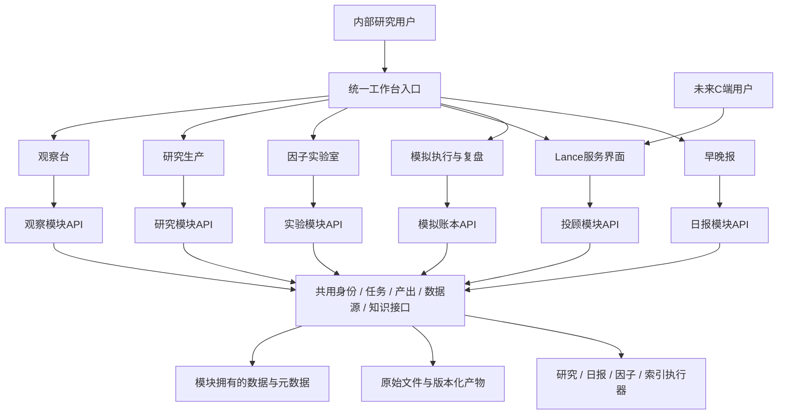

# 投研工作台01：完整产品与前中后台架构方案 V0.2

状态：**待用户评审，尚未批准实施**。盘点日期：2026-09-15；成稿：2026-09-16。范围：只读盘点原项目、梳理复用与架构，不复制业务代码、不安装依赖、不迁移数据库、不修改自动化、不提交或部署本批方案。

## 1. 方案结论与任务理解

投研工作台01是多个现有产品的统一工作空间与共用服务平台。原产品是产品和业务逻辑的基线；新建目录是隔离开发方式，不能被解释为重新发明产品。N01只完成本地启动骨架，其六张入口卡片不能代表原产品迁建完成。

建议采用**统一入口 + 独立业务模块 + 逐步抽取共用服务**。先复制完整可用模块，在新副本上解决路径与启动适配，完成前台集合；再以明确契约连接数据与产出，最后逐步重构中后台。保留独立运行、单独包装、独立版本和回滚。

完整复用包括页面和导航、用户任务、研究规则、计算逻辑、Skill与提示模板、数据口径、产出格式、历史版本规则及相应验证。不是要求保留已知缺陷；修复必须记录行为差异。缺失的真实后端不以演示数据替代。

## 2. 产品边界与角色

| 模块 | 定位与核心用户任务 | 负责的业务事实 | 不应承担的职责 |
|---|---|---|---|
| Lance / 投顾助手 | C端投顾服务与助手；解释、学习、计划、跟踪和服务内容交付 | 客户服务上下文、内容版本、服务会话；原有画像、内容任务及交易前检查原型 | 不直接修改研究结论，不调用未经授权的执行工具 |
| 原投研工作台 / 研究生产 | 工作流 + Skill + MCP/工具的研究生成与产出 | 研究任务、执行轨迹、报告、工具与Skill版本 | 不成为所有模块的数据库或同步任务主进程 |
| 投研观察台 | 围绕当前投研逻辑长期观察与沉淀 | 观察池、指标序列、叙事判断、证据与反证、版本 | 不替代研究生成器或量化回测引擎 |
| 因子实验室 | 因子发现、组合研究、回测与验证 | 因子定义、样本、实验参数、引擎、结果 | 不把实验结果自动当作执行指令 |
| 知识与证据服务 | 后台支持，保留管理入口与原阅读能力 | 原资料、切片、来源与索引版本 | 不让生成回答改写原始资料 |
| 模拟交易与复盘 | 研究之后的模拟执行及反馈 | 模拟账本、成交、持仓、判断引用、复盘 | 不默认连接真实券商交易 |
| 投资早晚报 | 每日研究入口与持续产出 | 报告身份、截止时点、版次、质量和归档 | 不与研究工作台的 today 活动摘要混同 |

初期用户以 Sam 的内部研究与产品探索为主；Lance保留C端产品定位，但真实客户账号、外部发布和客户隔离属于后续上线边界。前台导航的层级不等于后端服务的数量。

## 3. 前台信息架构

建议顶层为“今日工作区、投研观察台、研究生产、因子实验室、Lance投顾助手、模拟交易与复盘”，另设“知识与数据管理”和“系统管理”。早晚报放在今日工作区并有固定直达入口；知识库偏后台，不强占高频投研导航。模块命名供本轮确认。

| 入口 | 必须继承的二级页面/操作 |
|---|---|
| 今日工作区 | 最新早晚报、日期/版次/关键词查询、原版HTML与JSON、缺报/补刊状态；跨模块最近任务和产出后续聚合 |
| 观察台 | 总览、市场指数、风格、信号矩阵、宏观路径、叙事、信用周期六面板、产业链、公司、2027—2028观察、证据与来源管理 |
| 研究生产 | 原工作台任务与Skill执行、报告库、监控/信号、信息源、Skill管理、模拟组合和回测原有入口，先整体保留 |
| 因子实验室 | 原资产选择、因子库、权重/参数、回测、策略比较、实验与敏感性内容；按照源产品实际实现继承 |
| Lance | 原引导画像、今日、能力圈、内容节点、Mission任务、个人页、交易前检查和介绍路由；不先重做成聊天框 |
| 模拟交易与复盘 | 第一阶段聚合进入各原模块的模拟功能；后续明确账本主服务后统一操作 |
| 知识与数据管理 | 原知识导航与阅读、资料目录、切片状态；后续索引任务、检索质量、数据源与口径管理 |

模块内保留原信息架构。统一壳只增加回到工作台、当前模块、服务状态与跨模块跳转；避免外层与内层重复占用两列导航。页面布局统一与功能复用分开验收。

## 4. 当前资产与成熟度

本轮静态代码核对，不等同依赖安装、上游认证或全量运行验收。详情与证据见[源产品盘点](源产品盘点.md)。

| 原资产 | 实际实现 | 已知未完成或需核验 |
|---|---|---|
| Lance | Next.js/React交互原型、浏览器状态、4个计算/契约API | 持久化后台、真实服务账号与外部数据尚未落地；界面“已开启”不代表真实控制 |
| 原研究工作台 | 原生Web前台 + Express 23路由，14份Skill文件，CLI/Python/模型工具执行、SQLite及JSON/报告文件 | 14个文件不等于14个均上线；长任务恢复、鉴权、覆盖写和工具权限需改造 |
| 观察台 | 自包含HTML/JS + Python构建，localStorage保存，JSON导入导出，叙事与证据版本 | 自动行情/财务接入、服务端持久化、迁域数据导入待完成 |
| 因子实验室 | 静态前台、JS/Python回测与数据流水线、基金SQLite底座 | 运行环境与数据新鲜度未实测；不同引擎/现金流口径不可直接比较 |
| 知识库 | 原Markdown、HTML阅读导航、PDF、231条切片 | 未验证部署向量索引或检索API，不能称现成RAG服务 |
| 早晚报 | Agent采集编辑 + Python发布/固定渲染 + 哈希归档查询；当前目录索引5份报告 | 仍依赖桌面调度，完整线上队列与State事务未完成；离线引擎只支持synthetic |
| 新N01 | Node 22.23.1零依赖本地API、静态六区占位、测试与Wiki | 不是上述产品的替代实现；新增架构需在新副本实施 |

## 5. 观察台研究框架：冻结继承，不缩减

当前配置核对：16个指数、10种风格比较、20组四维信号、40项宏观指标、38家公司、5条传导链、7条叙事、6个信用观察面板。它们是观察配置数量，不代表已接通真实数据。

- 市场：A股沪深300/中证500/中证1000/创业板/科创50/中证红利；港股恒生/国企/恒生科技；美股标普500/纳指100/罗素2000/标普等权/费城半导体；日本TOPIX/日经225。
- 四维：量价、基本面、价值、动量。保留子指标、适用性、币种、复权/总收益口径；ETF代理不可冒充原指数。
- 信用六面板：信用供需、支出投入、订单产能、利润现金、偿债损失、扩散集中。
- 五条产业传导：财政项目；住房耐用品；消费渠道；AI与电力资本开支；美国一般企业与居民。
- 中国消费：收入就业/信用 → 消费意愿与支出 → 商品服务与渠道 → 公司销量售价/库存账期 → 利润现金。区分补贴拉动与自主需求。
- 美国通胀下行：价格与成本 → 融资供需 → 居民/企业支出 → 订单库存 → 利润现金/再融资/违约。区分供给改善与需求收缩。
- 2027—2028主线：中美信用周期去向，头部与非头部、行业、融资资质之间的异质性；保留宏观汇总、中位数、改善宽度与头部集中度的比较。

复制验收必须覆盖指标详情、公司对比、筛选、叙事历史、证据/反证、承诺与到期观察、导入导出、真实/示例切换。迁域后浏览器localStorage不会自动转移：需从旧入口主动导出，经校验在新入口导入，不能假定复制HTML已带走用户记录。

## 6. 前台集成方案与取舍

| 方式 | 价值 | 成本和边界 | 建议 |
|---|---|---|---|
| 复制子应用 + 路由入口 | 保留代码与产品结构，可独立运行，风险易隔离 | 各框架资源路径、API前缀、状态需适配 | 第一阶段默认 |
| iframe承载完整旧页面 | 快速保留样式，降低CSS冲突 | 焦点、下载、认证、深链、存储和移动体验需验证 | 仅对暂时无法适配的静态模块作过渡，保留独立打开 |
| 全部改写为单一React应用 | 长期体验一致 | 容易丢逻辑，工作量与回归范围大 | 不作为当前阶段方案 |
| Module Federation等运行时组件拼装 | 细粒度组合 | 当前技术栈差异大，共享依赖和运行复杂度高 | 暂不引入 |

建议模块路径 /modules/lance、/modules/research、/modules/observatory、/modules/factors；API保留模块命名空间，避免都占用 /api。具体代理配置在复制试验后冻结。Lance的Next子路径需要构建时配置，不能只在反向代理上加前缀；还要检查图片、fetch、重定向和静态资源。[Next官方basePath说明](https://nextjs.org/docs/app/api-reference/config/next-config-js/basePath)

N01目前仅公开三个静态资产，不能直接当作成熟网关。新增代理、鉴权及模块注册需要单独实现与验证。外层壳对不同模块展示就绪/离线/需配置，单模块错误不影响全局导航。

## 7. 总体技术架构

图为逻辑边界，不要求第一版启动同等数量的微服务。建议一份新项目代码仓库、多进程部署，模块API可先放在一个Node宿主中，重计算和长任务独立进程；保留后续拆分接口。复制阶段保留原Express、Next、Python及静态应用，不统一改写语言。

目标Node服务层逐步引入TypeScript与可共享JSON Schema契约；Python执行器消费同一契约。具体框架与版本在后端实现批次锁定，当前不替换原依赖。前端可以沿用原React/原生JS，统一设计系统作为后续工作。

## 8. 中台共用能力：抽取顺序

| 能力 | 第一阶段 | 目标职责与边界 |
|---|---|---|
| 模块注册 | 配置入口、启动命令、健康状态、数据依赖 | 支持独立构建启动、关闭和导出 |
| 产出目录 | 索引原报告/实验/日报的描述与链接 | Artifact元数据统一，原格式与字节哈希保留 |
| 标的与指标映射 | 建别名/供应商代码映射，不重算原数据 | Instrument/Metric版本；市场、币种、频率与适用范围 |
| 任务基础设施 | 暴露原任务状态，区分无法恢复的遗留执行 | Job/Step/Attempt、取消、超时、租约、重试、日志和预算 |
| 数据与工具网关 | 每模块先通过适配器使用原集成 | REST/SDK/CLI/MCP统一授权与返回封装，保留原始响应；协议形式不强行统一 |
| 知识检索 | 先提供原文件和元数据检索 | 原文→切片→索引→带引用检索，权限贯穿检索与产出 |
| 模型与Skill登记 | 保留原Skill文件、参数与行为 | 固定Skill哈希、模型/提示版本、工具权限、实际用量与费用 |
| 身份与权限 | 本机私有阶段不创建虚假客户体系 | 线上内部访问认证；C端独立角色、工作空间与可见性 |
| 运行观测 | 模块状态、失败原因与运行日志 | trace_id贯穿请求/任务/工具/产物；数据延迟、成本和队列等待可观察 |

工具权限按用途给名单，例如报价/财务查询与交易命令分离。供应商可见、安装成功、认证有效、品种授权、返回数据新鲜是不同状态。TradingView接入需逐项验证供应能力；不把经纪商接口文档当成通用行情MCP。模型不直接获得全局数据库写权限。

## 9. 数据所有权、契约与跨模块协作

| 数据对象 | 业务所有者 | 其他模块使用方式 |
|---|---|---|
| Instrument、MetricDefinition、Source | 共用数据登记 | 版本化引用，保留模块别名，不以显示名称连接 |
| Observation、ThesisVersion、EvidenceLink | 观察台 | 只读快照/引用；新证据进入待审核，不自动改判断 |
| ResearchRun、SkillVersion、Report | 研究生产 | 读取产出或提交新任务，禁止直接写内部表 |
| DailyIssue、DecisionObject、State/Ledger | 日报领域 | 查询发布版本；State/Ledger提交使用独立规则与事件 |
| FactorDefinition、DatasetSnapshot、Experiment | 因子实验室 | 引用结果、参数、引擎与口径，不读取可变“最新文件” |
| Document、Chunk、IndexVersion | 知识服务 | 有权限的检索、原文定位与来源哈希 |
| CustomerProfile、ProfileField、RiskAssessment、ServiceCase、ContentPackage、Review、Delivery | Lance投顾服务 | 研究产物经选择/审核转为服务内容 |
| PaperAccount、Order、Fill、LedgerEntry、Review | 模拟执行 | 接收明确模拟指令，反馈结果，不改写研究历史 |

公共元数据建议包含 id、schema_version、module、workspace_id、created_at、producer_version、trace_id、source_refs、visibility、quality_status。具体金融对象增加 observation_period、published_at、retrieved_at、cutoff_at、currency、unit、adjustment/return_basis。不同时间字段不可合并为一个updated_at。

Artifact区分逻辑id/内容版本/渲染版本/内容哈希；报告改样式不改研究事实。保持日报9月11日已确认版式基线，换壳不改报告CSS。

数据集与因子实验额外保存universe、engine、cashflow、cost、rebalance、lag、benchmark和missing_mask。Observation修改追加旧版本；会计式模拟流水采用追加/冲销；不能用覆盖JSON替代账本。

## 10. 三条端到端业务流程

**研究到投顾服务：**观察台选中命题与证据快照 → 研究模块创建任务并冻结Skill/工具配置 → 知识和数据适配器取证 → 产出报告 → 用户选择可服务内容 → Lance生成解读草稿并关联来源 → 审核后形成内容版本 → 后续明确的交付动作。内部研究笔记和私人组合不随报告默认开放给C端。

**因子到模拟复盘：**冻结数据和样本 → 因子实验 → 同口径比较与验证 → 用户明确选择模拟方案 → 模拟账本记账 → 绩效与判断引用 → 复盘返回研究线索。回测、未来Lance教学模拟和现有研究组合绩效必须标记不同引擎，不共享一个含糊的“收益率”。

**每日报告到长期观察：**定时创建日报任务 → 截止前可得性检查/数据质量 → 编辑与校验 → 版本化发布 → 今日入口可查询 → 提取证据候选 → 用户确认后更新观察判断。迟到用补刊，缺失数据保留缺口；日报任务成功不等于State已提交。

上述跨模块请求优先通过API；耗时任务返回202及job_id。可靠事件在后端阶段引入事务outbox，同事务保存业务更新与待发送事件，消费者按event_id幂等；使用至少一次交付及可重放，不承诺网络上的恰好一次。

## 11. 持久化、部署与性能

**复制接入期：**各副本保留各自数据格式和存储，通过Adapter暴露读写；新项目配置路径全部落在新根目录，禁止执行时回写原目录。旧浏览器存储通过导出/导入迁移；数据库复制前需停写快照或一致性备份，不直接复制运行中的单个SQLite文件。

**目标中后台：**建议一个PostgreSQL实例按模块schema及数据库角色隔离，原文件/报告/实验存入版本化对象存储；本地可以用受控文件目录实现相同ArtifactStore接口。SQLite与JSON迁移按模块分批，不要求前台接入前全部改完。schema本身并非安全边界，还需权限、角色及搜索路径控制；C端场景另加API授权与数据隔离。[PostgreSQL schema说明](https://www.postgresql.org/docs/17/ddl-schemas.html)、[行级策略说明](https://www.postgresql.org/docs/18/ddl-rowsecurity.html)

初期任务可用PostgreSQL持久化队列与租约；研究、日报、索引和因子设置不同并发池，避免因子运算挤占出刊。是否增加专门队列或Redis由等待时间、并发和数据量决定，暂不引入Kafka/Kubernetes。

性能验收建议（目标、未测得）：本地固定测试数据热查询P95小于500ms；非外部调用页面在约定测试机上2秒内可操作；任务接收不等待模型完成；长列表分页；历史报告不全部塞入首页HTML；CPU密集回测从Web进程隔离。正式阈值随测试数据量和部署环境冻结。

缓存必须带供应商、标的、频率、调整口径与时点；前台标注新鲜度。外部供应商超时返回部分结果和缺口，不把旧缓存冒充实时。共用缓存不混入客户私有内容。

部署建议先本地独立启动 + 统一启动清单，再单主机容器组合的内部私有版；Lance真实C端上线单独发布。各模块提供独立启动入口、健康检查、依赖清单、数据导出和版本号。开发端口仅回环监听，发布网关与鉴权到上线阶段实现。

## 12. 完整复用与迁移验收

复制前固定来源路径、commit及未提交差异/文件哈希；排除.git、密钥、node_modules、虚拟环境、缓存；报告/知识原文/数据快照单独建立复制清单和授权，不能因复制代码而自动搬运私人数据。

| 模块 | 核心复用验收 |
|---|---|
| Lance | 原路由可访问、浏览器状态往返、4个API行为、内容/Mission/交易检查展示流程一致；演示与真实标识保留 |
| 研究生产 | 每个Skill入口与参数、流式响应、成功失败记录、报告库、监控信号、组合功能回归；上游未授权时可用隔离测试 |
| 观察台 | 上述配置清单全覆盖，宏观/公司/叙事可追踪，导入导出和历史版本可恢复 |
| 因子实验室 | 相同数据快照与参数下结果在预设误差内一致；现金流模式分别验收，不能只验证页面存在 |
| 知识库 | 原文件和切片数量/哈希、来源路径映射、阅读跳转；检索需用固定问题验证原文定位和引用 |
| 日报 | 同一JSON渲染保持既定版式、查询与归档哈希一致，scheduled/late/manual状态正确；不改旧归档 |
| 模拟执行 | 分清原有组合回测、纸面报告与交易检查入口；当前并无统一账本，输入、收益口径与流水对账后才能统一 |

独立包装验收：不启动统一壳和其他业务模块，本模块核心已实现流程仍可运行；必须依赖的共享服务逐项列明，离线模式的能力限制明确标注。

跨模块验收：断开一个模块其余仍可用；任务失败重试不重复发布/记账；停机重启恢复状态；重放事件不重复消费；禁止越权引用C端内容；旧目录写入次数为零（通过运行路径检查与前后清单核验，而非仅口头保证）。

## 13. 已识别的接入前风险

1. 研究任务当前在完成后追加JSON，过程缺持久化恢复；同日同参数报告可能覆盖，需在新副本修复后承接可靠产出。
2. 原工作台未见统一鉴权；Longbridge CLI传参尚需明确命令许可。复制不是公网开放许可。
3. 观察台securityTemplate使用未定义id，静态检查发现可能导致对象模板下载异常；verify.cjs仍硬编码1份日报，而当前归档为5份。复制时修复并增加对应行为验收，本轮未修改或声称旧测试全部通过。
4. 日报发布脚本含硬编码旧路径、assert校验与同步触发构建；需路径配置化、显式校验异常与发布/索引解耦，保持原格式和幂等规则。当前补刊被合并为early展示，后续需区分补刊/提前/周末版。
5. Lance画像问卷与交易检查原型不可当真实客户适当性控制；迁入保持标注，外部服务前补后台约束。
6. 因子不同引擎、数据缺失、同列权重组合和时间对齐需回归；观察台描述性因子与实验室可交易因子不强行合并。
7. 原知识库是可复用知识资产，索引服务属于新增能力；切片存在不等于RAG已上线。

风险表来自静态核对，不是全量安全审计；具体条目在复制实施批次定位、测试和关闭。

## 14. 实施拆解、资源与版本

| 批次 | 优先级 | 工作 | 交付门槛 | 依赖 |
|---|---|---|---|---|
| A00 本轮 | P0 | 产品技术盘点、复用映射、架构决策与独立审查 | 用户确定方案 | 无 |
| A01 | P0 | 固定原版本、建立副本、模块注册和独立启动 | 原功能清单可逐项验收，原项目未写入 | A00确认 |
| A02 | P0 | 统一导航和完整前台接入、日报原样阅读 | 所有原模块核心页面可操作，缺口明示 | A01；可按模块并行 |
| A03 | P0 | 数据/产出/来源契约，模块持久化与任务基础设施 | 稳定标识、版本、重试与恢复验证 | A01盘点；与A02部分并行 |
| A04 | P1 | 研究→观察、因子→模拟、知识→投顾、日报→证据协作 | 三条端到端流程与权限测试 | A02/A03 |
| A05 | P1 | 内部私有部署、备份恢复、监控、文档 | 可恢复且可回滚的第一版 | A04和发布确认 |
| A06 | P2 | Lance对外服务与统一设计系统 | C端隔离、审核交付与服务验收 | 单独产品范围确认 |

原N02—N07计划在方案批准前暂停直接实施，以A批次作为待评审替代计划；旧记录保留，不抹去历史。研究与观察能力不能等到后端大重写结束才看见。

用量：无法取得主/子Agent项目级实际token，记为未知；账户额度不当作项目成本。每批记录工具/模型提供的实际usage、运行次数、耗时、失败与重试；估计和实测分列。先以一个模块复制试验测得消耗再估后续，避免制造精确总token预算。独立审查作为单独任务记录。

代码与文档每日形成解释性提交，实际GitHub远端和同步方式确认后再上传；本轮仅文档工作区变更，不新增Git提交。模块版本、数据版本、Skill/提示版本、实验版本、报告内容/渲染版本分别记录。日志及Wiki记录决策依据和验证，不保存内部推理链。

## 15. 待确定的方案选择

| 决策 | 推荐方案 | 备选及影响 |
|---|---|---|
| 首版交付边界 | 内部统一工作台可用，Lance原型完整迁入 | 同时面向真实C端，则认证、客户隔离、内容审核和交付须提前 |
| 前台接入 | 保留原子应用与页面结构，统一导航，必要时暂用嵌入 | 全部重写统一界面会显著扩大回归与工期 |
| 后台节奏 | 先各模块独立运行，后分批抽取共享任务/产出/知识与数据能力 | 先统一数据库和框架，会推迟原产品可见可用 |
| 执行域 | 保留现有交易检查与研究组合场景，教学模拟列为未来扩展，后统一账本接口 | 立即统一账户，需先确定资金流、定价与用户边界 |
| 首轮复制顺序 | 观察台+日报验证研究继承，再研究生产/因子/Lance；可独立并行 | 若近期优先验证C端服务，可把Lance提前 |

这些推荐用于评审，不视为用户已接受。真实券商执行、具体客户服务范围、云供应商及预算未确定。

## 16. 文档与证据入口

- [源产品盘点](源产品盘点.md)
- [架构决策记录](ADR-002-模块独立与共用能力.md)
- [复用验收矩阵](复用验收矩阵.csv)
- [评审记录](评审记录.md)

本轮只读查看原文件与关键源码，没有访问私人持仓内容、读取密钥、调用行情或模型供应商、运行原产品任务。后续必须以模块运行验收补足静态盘点。
